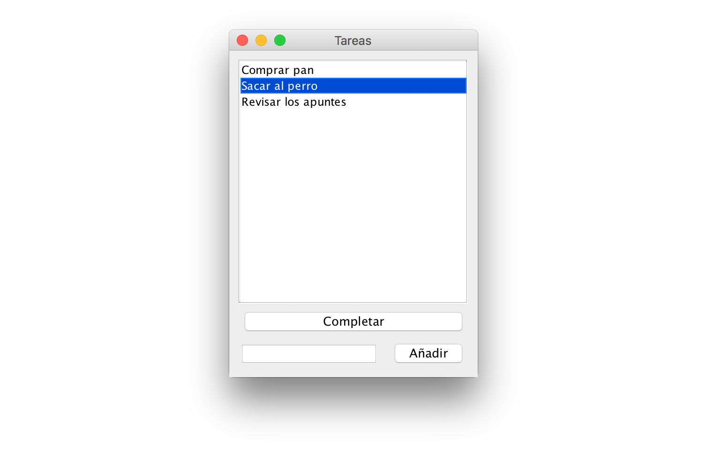

# Tareas

Crea una aplicación que permita mantener una lista de tareas pendientes con un interfaz de usuario creado en Swing como este:

## Restricciones

- De cada tarea almacenamos el título y si está completada o no.
- La aplicación permitirá ver las tareas pendientes en un JList, añadir nuevas tareas y marcar tareas como completadas (al marcarlas como completadas no se muestran en la lista pero seguirán en memoria).
- Como mecanismo de persistencia, utiliza un archivo JSON que se carga al iniciar la aplicación y se vuelca a disco al cerrarla (contendrá todas las tareas, completadas o no).
- Para manipular los archivos JSON usará la librería [Gson](https://github.com/google/gson) de Google.
